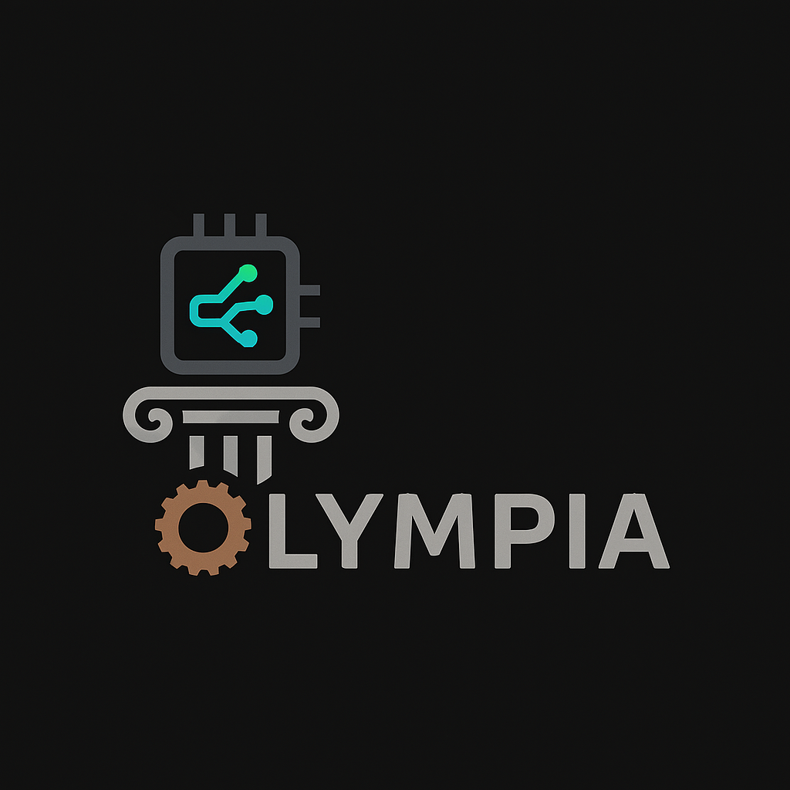

# Olympia

 

**Olympia** is a binary **disassembler and lifter** that transforms native **ELF binaries** into **LLVM IR** or **MLIR** bitcode, enabling advanced program analysis, transformation, and optimization at a high level of abstraction.

> ⚠️ Currently, only **ELF (Executable and Linkable Format)** files are supported.

---

## 🔧 Getting Started

### Prerequisites

Install [Rustup](https://rustup.rs/), which sets up the Rust toolchain:

```bash
curl --proto '=https' --tlsv1.2 -sSf https://sh.rustup.rs | sh
[Olympia logo](./logo.png)
